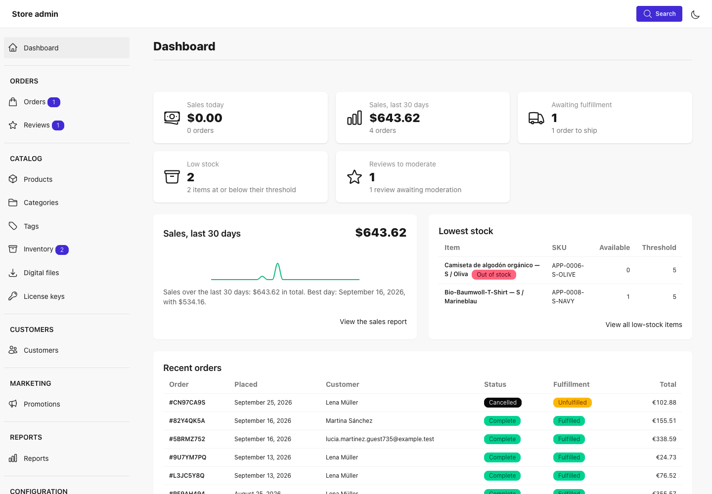
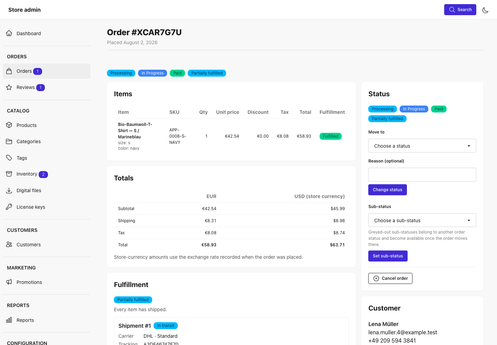
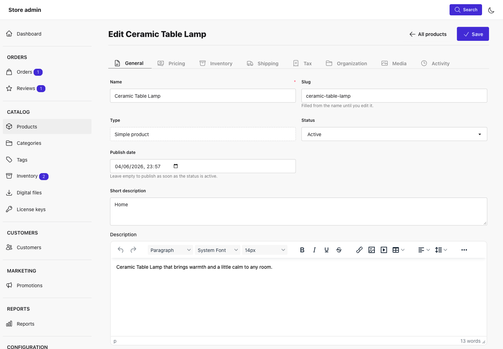
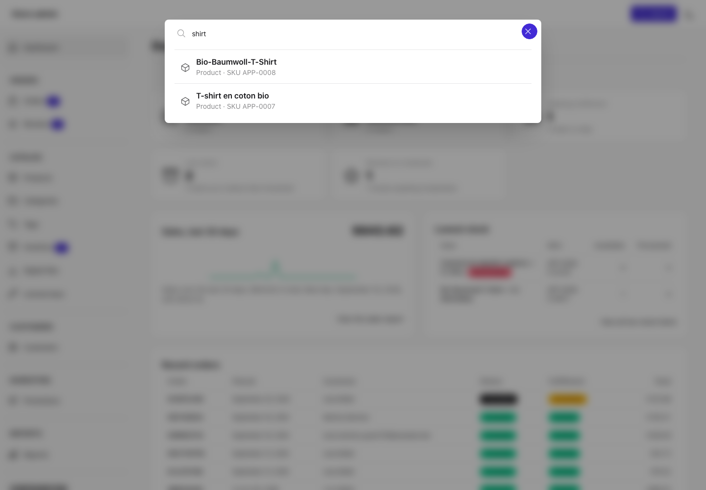

# ArtisanPack UI Ecommerce Admin (Livewire)

A Livewire admin for the [`artisanpack-ui/ecommerce`](https://github.com/ArtisanPack-UI/ecommerce) engine, built on
[`artisanpack-ui/livewire-ui-components`](https://github.com/ArtisanPack-UI/livewire-ui-components). It covers orders,
reviews, products, categories, tags, inventory, digital files, license keys, customers, promotions and coupons,
shipping, tax, reports, notification templates, webhooks, order statuses, kanban boards, and store settings. It renders
inside the `cms-framework` admin when that package is installed, and as a standalone admin otherwise. Every screen and
action checks the engine's abilities, and other packages extend it through registries and filters.

## Screenshots









## Requirements

- PHP 8.3+ with `bcmath`
- Laravel 12 or 13
- Livewire 3.6+ or 4
- `artisanpack-ui/ecommerce` 1.0
- `artisanpack-ui/livewire-ui-components` 2.1
- Tailwind CSS 4 and daisyUI 5 (`~5.0`) in your application's Vite build

Optional: `artisanpack-ui/cms-framework`, `artisanpack-ui/media-library`, `artisanpack-ui/icons`,
`artisanpack-ui/accessibility`, `artisanpack-ui/ecommerce-kanban-livewire`, `phpoffice/phpspreadsheet` (XLSX export),
`barryvdh/laravel-dompdf` (PDF export). See [Requirements](docs/installation/requirements.md).

## Installation

```bash
composer require artisanpack-ui/ecommerce-admin-livewire
php artisan ecommerce-admin:install
```

The install command publishes `config/artisanpack/ecommerce-admin-livewire.php`, prints the front-end steps, and, with
`cms-framework`, registers RBAC permissions and a `shop-manager` role.

## Quick start

1. **Grant access.** The engine denies every ability by default, so every screen returns 403 until you grant access.
   In a service provider's `boot()`:

   ```php
   Gate::define( 'ecommerce.admin', fn ( $user ) => $user->is_admin );
   ```

   Or define individual `ecommerce.{resource}.{action}` abilities, or assign the `shop-manager` role with
   `cms-framework`. See [Authorization](docs/authorization.md).

2. **Open the admin** at `/ecommerce-admin` (the `admin.route_prefix` config key).

3. **Optionally seed a demo store** on a development database:

   ```bash
   php artisan ecommerce:seed-demo
   ```

Add your 2FA middleware to `admin.middleware`. Neither the engine nor the admin applies it.

## Front-end setup

The package ships no CSS or JavaScript build. In your application:

1. Add the `@source` lines the install command prints to your Tailwind entry:

   ```css
   @source "../../vendor/artisanpack-ui/ecommerce-admin-livewire/resources/views/**/*.blade.php";
   @source "../../vendor/artisanpack-ui/ecommerce-admin-livewire/src/**/*.php";
   ```

2. Install and import the scripts the components need:

   ```bash
   npm install @artisanpack-ui/livewire-drag-and-drop apexcharts flatpickr
   ```

   Import `@artisanpack-ui/livewire-drag-and-drop`, set `window.ApexCharts` and `window.flatpickr`, and import the
   component library's `sparkline.js` and `tinymce-editor.js`.

3. Publish TinyMCE for the description editor with `php artisan vendor:publish --tag=artisanpack-assets` and load
   `/vendor/artisanpack-ui/js/tinymce/tinymce.min.js`.

4. Pin `daisyui` to `~5.0`. Later releases leave the component library's tab panels empty
   ([livewire-ui-components#119](https://github.com/ArtisanPack-UI/livewire-ui-components/issues/119)).

The layout loads your `resources/css/app.css` and `resources/js/app.js`. See
[Front-End Setup](docs/installation/front-end.md) for the full steps and a working reference.

## Documentation

- [Documentation home](docs/home.md)
- [Quick start guide](docs/getting-started.md)
- [Installation](docs/installation.md): [requirements](docs/installation/requirements.md),
  [configuration](docs/installation/configuration.md), [front-end setup](docs/installation/front-end.md),
  [layouts](docs/installation/layouts.md)
- [Usage](docs/usage.md): [screens](docs/usage/screens.md), [dashboard](docs/usage/dashboard.md),
  [command palette](docs/usage/command-palette.md), [real-time updates](docs/usage/real-time.md),
  [product CSV](docs/usage/product-csv.md)
- [Authorization](docs/authorization.md)
- [Extending](docs/extending.md) and the [hooks reference](docs/extending/hooks-reference.md)
- [Accessibility](docs/accessibility.md) and [localization](docs/localization.md)
- [Advanced](docs/advanced.md): [Artisan commands](docs/advanced/artisan-commands.md),
  [browser tests](docs/advanced/browser-tests.md)
- [FAQ](docs/faq.md) and [troubleshooting](docs/troubleshooting.md)

## Contributing

As an open source project, this package is open to contributions from anyone. Please [read through the contributing
guidelines](CONTRIBUTING.md) to learn more about how you can contribute to this project.

```bash
composer test           # unit and feature tests
composer lint           # php-cs-fixer (dry run) and phpcs
composer test:browser   # browser suite; see docs/advanced/browser-tests.md
```

## License

The MIT License. See [LICENSE](LICENSE) for details.
